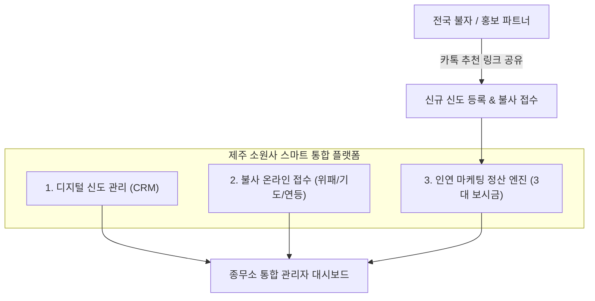

# [제안서] 제주 소원사 스마트 사찰 통합 관리 플랫폼
### — 디지털 신도 명부 관리와 포교·불사(위패/기도) 연계 ‘인연(因緣) 마케팅’ 시스템 구축 —

---

## 1. 제안 배경 및 필요성

### 사찰의 당면 과제와 시대적 변화
* **신도 고령화 및 신규 유입의 정체**: 전통적인 지인 소개에만 의존하던 방식에서 벗어나, 젊은 세대와 전국의 불자들을 적극적으로 유치할 수 있는 현대적 포교(전법) 통로가 절실합니다.
* **수기·엑셀 관리의 한계**: 
  - 신도 명부, 가족 생년월일(음력), 기도 및 위패 접수 내역이 분산되어 있어 분실 위험과 업무 피로도가 높습니다.
  - 초파일(연등), 백중, 동지 등 대목마다 접수 및 축원 명단 정리에 막대한 시간과 인력이 소모됩니다.
* **불사(위패/천도재/기도) 확장의 병목**: 
  - 적극적인 소개와 동참을 이끌어내기 위해서는 동참을 권선(勸善)한 불자들에게 감사의 보시금(수수료)을 투명하고 정확하게 돌려주는 체계가 필수적입니다.
  - 수기 정산은 계산 착오와 불신을 낳아 영업 조직 확산에 한계가 발생합니다.

---

## 2. 제안 솔루션 개요: 「소원사 인연(因緣) 통합 플랫폼」

> **“하나의 시스템으로 사찰 살림은 스마트하게, 불사 동참은 전국구로 폭발시키는 맞춤형 웹 플랫폼”**

---

## 3. 핵심 기능 구성

### ① 스마트 신도 명부 관리 (종무소 행정 혁신)
* **가족 단위 통합 명부**: 세주(대표 신도)를 중심으로 배우자, 자녀, 손주까지 음력 생년월일 및 띠, 발원문 통합 관리.
* **음력 생일 / 제사일 자동 알림**: 매월 초하루 법회, 가족 생일, 기일 축원 안내 문자(알림톡) 원클릭 발송 연동.
* **기도 이력 조회**: 신도별 과거 연등, 인등, 백일기도, 위패 봉안 내역을 한눈에 조회.

### ② 불사(위패/기도) 온라인 접수 폼
* **모바일 맞춤 간편 접수**:
  - 영가(돌아가신 분) 본관/이름, 축원자 정보 입력.
  - 연등/인등/백일기도/위패 봉안 등 항목별 선택 및 무통장 입금 안내.
* **실시간 접수 알림**: 접수 즉시 종무소 관리자 및 추천인에게 실시간 확인 알림.

### ③ 전국 확산을 위한 ‘인연(因緣) 리퍼럴 마케팅’ 전산
* **불자/홍보 파트너 개인별 고유 추천 링크 발급**:
  - 예: `sowonsa.kr/?ref=보현화`
  - 링크를 카카오톡/밴드로 전달 시, 세련된 소원사 소개 및 위패/기도 랜딩페이지 노출.
* **투명한 3대(3-Tier) 보시금 자동 계산 엔진**:
  - 신규 신도가 등록되어 불사금을 입금하면 즉시 자동으로 추천 계보를 따라 보시금 적립.
* **불사 품목별 차등 요율 적용 (사찰 재정 보호)**:
  - **고단가 불사 (위패 봉안, 천도재, 생전예수재)**: 1대 30% / 2대 10% / 3대 10%
  - **정기·시즌 불사 (연등, 인등, 백일기도)**: 1대 30% / 2대 10% / 3대 10% *(협의에 따라 유동적 조정 가능)*
  - **일반 보시 (사찰 유지비, 쌀/과일 시주)**: 수당 제외 (100% 사찰 귀속)
* **파트너 전용 모바일 대시보드**:
  - 내가 인연 맺어준 신도 명단, 이번 달 적립된 보시금, 출금 신청 내역 실시간 확인.

### ④ 종무소 관리자(Admin) 전용 포털
* **입금 확인 원클릭 승인**: 사찰 통장 확인 후 버튼 클릭 한 번으로 접수 확정 및 수당 자동 지급 처리.
* **정산 엑셀 다운로드**: 월별 지급 대상자 명단, 은행 계좌, 지급액 엑셀 일괄 다운로드로 회계 사고 원천 차단.
* **권한 보안**: 주지스님, 종무소 보살님 등 담당자별 접근 권한 설정.

---

## 4. 기대 효과

| 구분 | 도입 전 (수기/기존 방식) | 도입 후 (통합 플랫폼 도입) |
| :--- | :--- | :--- |
| **신도 유치** | 제주 현지 및 기존 연고 중심 | **제주도 내 신도 확장은 물론, 카카오톡 링크를 통한 전국구 신규 불자 유입** |
| **위패 봉안 실적** | 사찰 방문객 대상 소극적 권선 | **전국 영업 파트너들의 적극적 홍보로 비약적 신장** |
| **행정 효율성** | 초파일/백중마다 엑셀 파일 및 장부 수기 대조로 수일 소요 | **클릭 한 번으로 축원 명단 및 등표 출력 준비 끝** |
| **정산 투명성** | 엑셀 계산 실수 및 소개자 간 불신 발생 | **시스템 자동 계산으로 신뢰도 100%, 파트너 충성도 확보** |

---

## 5. 시스템 구축 및 유지관리 제안 견적

일반 IT 외주 개발사 대비 사찰 특성을 100% 반영하고 불필요한 거품을 제거한 실비 기준 제안입니다.

### [제안 견적서]
* **1. 시스템 구축비 (초기 1회)**: **`700만 원`** (VAT 별도)
  - *시중 전문 전산 개발사 견적: 1,500만 ~ 2,000만 원 상당*
  - 계약금 50% (350만 원) / 납품 및 검수 완료 시 50% (350만 원)
  - 포함 내역: 신도 DB 구축, 모바일 접수 폼, 3대 수당 엔진, 종무소 관리자 포털, 기존 홈페이지 연동
* **2. 월 정기 시스템 유지관리비**: **`월 40만 원`** (VAT 별도)
  - 고성능 클라우드 서버 호스팅 및 일일 데이터 자동 백업
  - 수당 정산일 시스템 오류 방지 및 실시간 기술 지원
  - 사찰 법회/행사 관련 전산 설정 업데이트 지원

---

## 6. 개발 및 도입 일정 (총 3주 소요)

* **1주차**: 소원사 신도 명부 항목 협의, 불사 품목별 수당 요율 확정, DB 설계
* **2주차**: 모바일 접수 화면 및 3대 수당 계산 엔진 개발, 관리자 화면 구현
* **3주차**: 종무소 실무 테스트, 데이터 검증, 관리자 사용법 교육 및 정식 오픈

---

**제안자**: 소원사 전담 IT 파트너 김철수 대표
**문의/협의**: [대표님 연락처]
